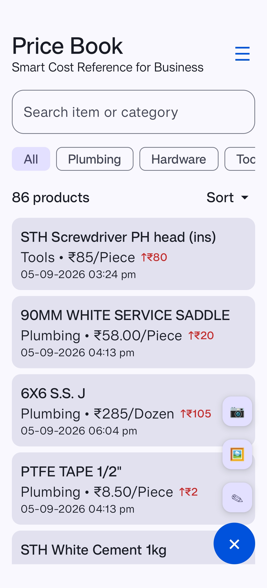
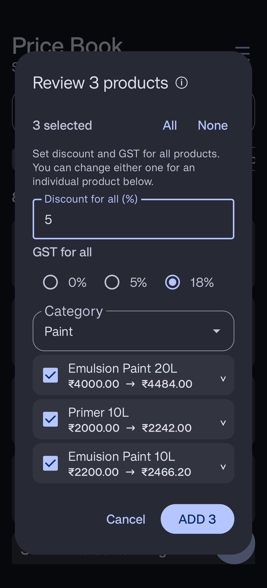
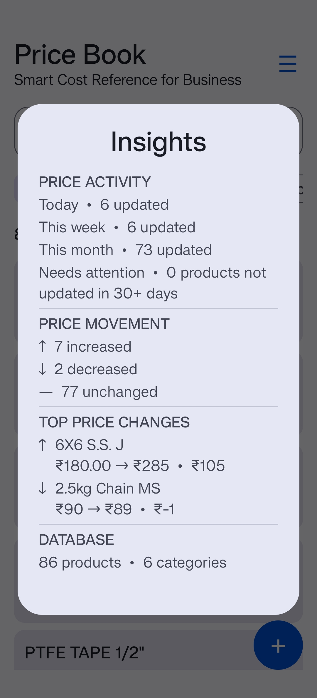
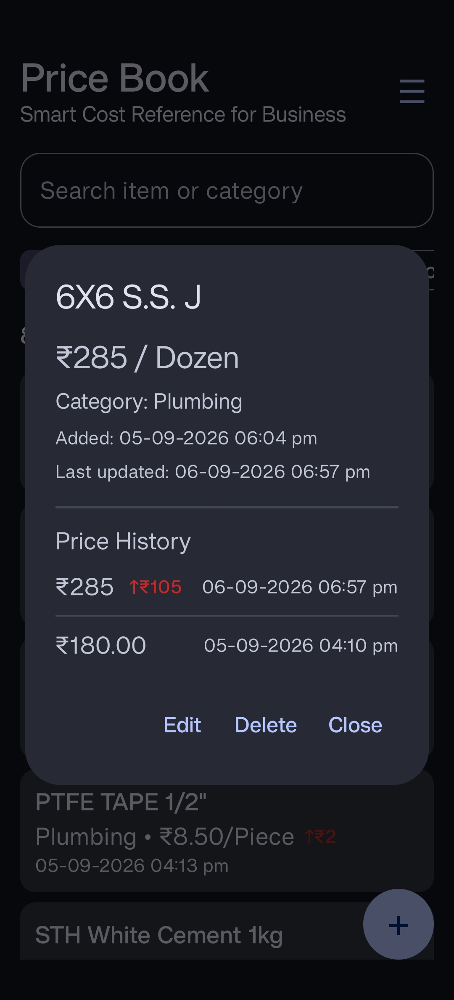
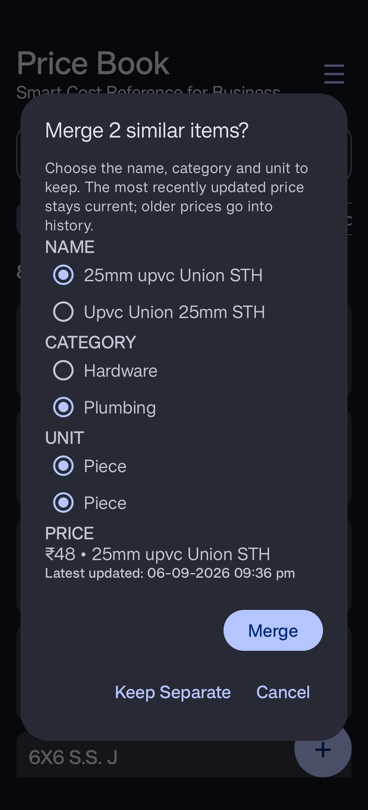
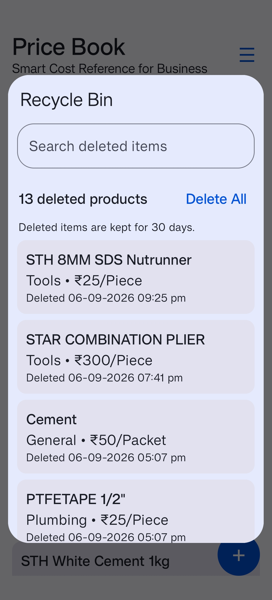

# Price Book

**A simple, practical way to manage product prices.**

Price Book is a fast, flexible utility for recording, organizing, and referencing product prices on the go.

Designed to stay simple and focused, Price Book lets you build and maintain your own price reference without complicated menus, unnecessary features, or clutter.

**Category → Product → Price → Unit**

## 🛠️ Features

### 🗂️ Categories & Units

Price Book comes with default categories and units to help you get started quickly.

**Default categories:**
- Hardware
- Hand Tools
- Power Tools
- Plumbing
- Electrical
- Paint
- Pipes & Fittings
- Fasteners
- General

**Default units:**
- Piece
- Pair
- Set
- Box
- Packet
- Kg
- Gram
- Litre
- Meter
- Foot
- Dozen

These defaults are only a starting point. You can customize them according to your own products and requirements:

- Add new categories and units.
- Rename existing categories and units.
- Remove categories and units you don't need.

### 💰 Fast Price Reference

Find product prices quickly when preparing quotations, estimating jobs, checking purchase prices, or making business decisions.

### 🔍 Instant Search

Search quickly by product name or category.

Search supports partial text and is not affected by capitalization.

### ↕️ Sort Products

Sort products by:

**Price**
- ₹ Low → High
- ₹ High → Low

**Date**
- Added — Newest first
- Added — Oldest first
- Updated — Newest first
- Updated — Oldest first

**Name**
- A → Z
- Z → A

**Price Change**
- Biggest increase ↑
- Biggest decrease ↓

### 📝 Easy Product Management

Add, edit, and delete products easily.

Long-press a product to edit it or enter selection mode for actions on multiple products.

### 🧠 Remember Last Used Category & Unit

Price Book remembers your most recently used category and unit, making repeated price entry faster and more convenient.

### 📷 Add Pricing from Photos

Add product pricing directly from bills or invoices using your **Camera or Gallery**.

Price Book uses on-device OCR to read:

- Item
- Rate
- Unit

Detected pricing is shown in a review screen before anything is added, allowing you to check and edit every entry.

Camera captures can be cropped and rotated before processing.

Discount and GST are entered manually during photo-based entry, with GST options for **0%, 5%, and 18%**.

**Always double-check every entry before adding. Photo reading can occasionally misread item names or rates.**

### 📈 Price History

Keep track of how product prices change over time.

When a product's price is updated, its previous price is preserved in its price history, allowing you to see how the price has changed instead of only seeing the current price.

### 📊 Insights

Get a quick overview of your price data at a glance.

Insights helps you see pricing activity and price changes across your Price Book, making it easier to understand your data without checking products one by one.

### 🔎 Similar Items

Find products that may have been entered more than once.

Similar Items identifies potentially similar product names, including variations in spacing, formatting, word order, and product dimensions.

Each suggestion is presented for review before anything is merged.

When merging similar products, you can independently choose the **name, category, and unit** to retain. The most recently updated price remains current, while the combined price history is preserved.

### ♻️ Recycle Bin

Deleted products are moved to the Recycle Bin instead of being immediately removed.

- Restore deleted products when needed.
- Permanently delete products with **Delete Forever**.
- Deleted products are automatically removed after 30 days.
- Product details and complete price history are preserved while in the Recycle Bin.

### 📊 Excel Backup & Restore

Back up your Price Book to Excel and restore it whenever needed.

- Export your product data to Excel.
- Restore your data from an Excel backup.
- Complete product price history is preserved during Export and Import.
- Categories and units are preserved as well.

### 👆 Gesture Controls

Quick actions are available from the **+** button:

- **Tap +** → Open Manual Entry, Camera and Gallery.
- **Long-press +** → Open Manual Entry directly.
- **Swipe up on +** → Open Gallery.
- **Double-tap +** → Open Camera.
- **Swipe left on Home** → Open the navigation drawer.

### 🎨 Material You Design

A clean Material 3 interface with dynamic colors and support for System, Light, and Dark appearance modes.

### 📡 Works Offline

Price Book does not require an internet connection for its core features.

Your products, prices, categories, units, and price history are stored locally on your device.

Photo-based pricing uses on-device OCR, so bill and invoice images do not need to be sent to an online service for processing.

### ⚡ Simple & Lightweight

Open the app and start recording prices immediately.

No sign-up, account, or unnecessary complexity.

## 📋 Ideal For

### Contractors & Tradespeople

Maintain an up-to-date price reference for materials and products used in quotations, estimates, and projects.

### Workshops & Handymen

Keep track of purchase prices for consumables, replacement parts, tools, and commonly purchased supplies.

### DIYers & Home Renovators

Record and compare material prices while planning and working on home-improvement projects.

### Small Businesses

Maintain a simple, personal price reference for frequently purchased or quoted products.

## 🔒 Privacy

Price Book is designed for personal and private use.

Your product catalog and price data are stored locally on your device. The app does not require an account or sign-in, and your data is not dependent on a cloud service.

Photo-based pricing uses on-device OCR for reading bills and invoices.

## 📱 Version

**Price Book 5.3 (151)**

## 📸 Screenshots

| Home | Add Pricing from Photo |
|---|---|
|  |  |

| Insights | Price History |
|---|---|
|  |  |

| Similar Items | Recycle Bin |
|---|---|
|  |  |

> **Note:** Product names, prices and other values shown in screenshots are for demonstration purposes and may not represent actual current prices. UI examples are intended to demonstrate the app's features and workflow.

## 📥 Download

Download the latest APK from the **Releases** section of this repository.

## 🔒 Source Code

Price Book is currently a closed-source application.

The source code is maintained in a private repository and is not included here.

## 💬 Feedback

Found a bug or have a suggestion?

Open an issue in this repository and include as much detail as possible.

For bug reports, please include the steps needed to reproduce the problem and, when possible, screenshots or other relevant details.

## 👨‍💻 Developer

**Husain**

© 2026
